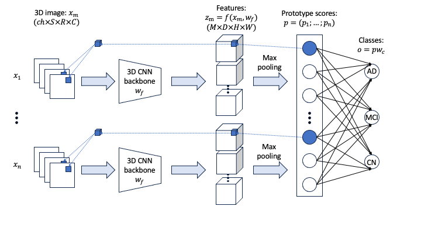

# Multi‑modal Alzheimer’s Prediction with Explainable AI

This repository is a fork of the original [PIPNet3D](https://github.com/desantilisa/PIPNet3D), adopted for a Master's Thesis project focusing on multi-modal 3D imaging and multi-class classification of Alzheimer's Disease.

## mmPIPNet
We present mmPIPNet: Multi-modal Patch-Based Intuitive Prototypes for Interpretable 3D Images Classification.

### Features
- Multi-modal Support: Integrates $n$ number of imaging modalities (e.g., MRI and Amyloid PET) as input.
- Multi-class Classification: Support both binary and multi-class classification.
- Generalized Pipeline: Automated adaption of the network architecture based on your dataset configurations.

### Architecture

## Quick Start Guide
The workflow is divided into four main steps: data conversion, dataset assembly, running the generalized training script, and running the generalized test script.

### 1. Preprocessing: Convert Images to Numpy
Before training, convert your medical images (e.g., `.nii.gz`) to NumPy format for efficient loading. This needs to be customized to your data.

### 2. Build your Dataset
The dataset is build in `make_mm_dataset.py`. This script generates the necessary dataframe for the training and testing pipline. It needs to be adjusted to your dataset and its file structure.

### 3. Training
The `main_train_pipnet.py` automatically configures the model's input and output based on your arguments, which can be set in `utils.py` (the command line is ok but the naming of the model and runs would be wrong).

### 4. Testing and Evaluation
Evaluate your trained model and visualize the learned prototypes using `main_test_pipnet.py`.

## Data Sources
Images and clinical stages were collected from the Alzheimer's Disease Neuroimaging Initiative (ADNI) [adni.loni.usc.edu](https://adni.loni.usc.edu).

## Acknowledgments
Codes adapted from [PIPNet3D](https://github.com/desantilisa/PIPNet3D) and [PIPNet](https://github.com/M-Nauta/PIPNet).
